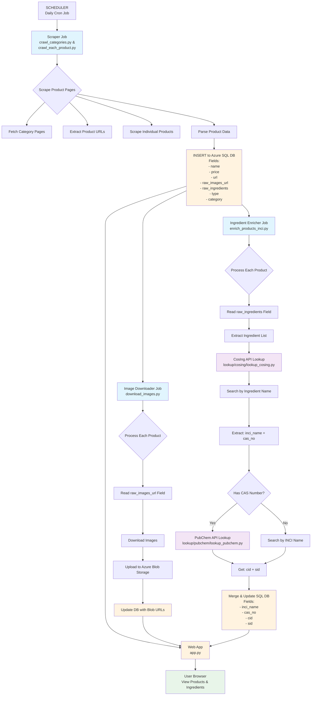
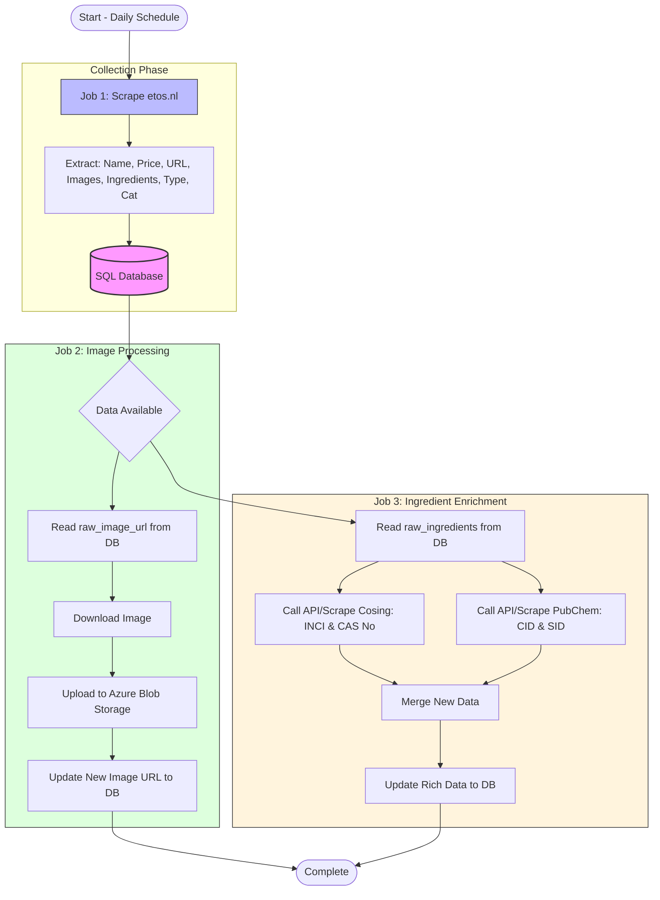

# Software Architecture Document (SAD)
## Allergy Label Crawler - Etos.nl

**Version:** 1.0
**Last Updated:** 2025-04-06
**Author:** Development Team

---

## Table of Contents

1. [Project Overview](#1-project-overview)
2. [System Architecture](#2-system-architecture)
3. [Main Data Flow](#3-main-data-flow)
   - [3.1 End-to-End Pipeline](#31-end-to-end-pipeline)
   - [3.2 Jobs Overview Diagram](#32-jobs-overview-diagram)
   - [3.3 Job Execution Details](#33-job-execution-details)
4. [Component Description](#4-component-description)
5. [Database Schema](#5-database-schema)
6. [External API Integrations](#6-external-api-integrations)
7. [Technology Stack](#7-technology-stack)
8. [Deployment Considerations](#8-deployment-considerations)

---

## 1. Project Overview

### 1.1 Purpose
The Allergy Label Crawler is a web scraping system designed to extract product information from Dutch pharmacy websites (primarily etos.nl). The system enriches product data with ingredient information from EU CosIng and PubChem databases to help users identify potential allergens in cosmetic and personal care products.

### 1.2 Key Features
- Automated daily scraping of product data from e-commerce websites
- Image download and storage on Azure Blob Storage
- Ingredient enrichment via CosIng and PubChem APIs
- Web interface for browsing and searching products
- Support for multiple product categories

### 1.3 Scope
- Target websites: etos.nl (expandable to other Dutch pharmacy sites)
- Product types: Cosmetics, personal care products, skincare items
- Data storage: Azure SQL Database + Azure Blob Storage

---

## 2. System Architecture

```
┌─────────────────────────────────────────────────────────────────────────────┐
│                          ALLERGY LABEL CRAWLER                              │
├─────────────────────────────────────────────────────────────────────────────┤
│                                                                             │
│  ┌──────────────┐      ┌──────────────┐      ┌──────────────┐              │
│  │   SCHEDULER  │─────▶│  JOB QUEUE   │─────▶│   WORKERS    │              │
│  │   (cron)     │      │  (task mgmt) │      │  (executors) │              │
│  └──────────────┘      └──────────────┘      └──────────────┘              │
│          │                     │                       │                    │
│          ▼                     ▼                       ▼                    │
│  ┌──────────────┐      ┌──────────────┐      ┌──────────────┐              │
│  │  SCRAPER     │      │  DOWNLOADER  │      │  ENRICHER    │              │
│  │  Job 1       │      │  Job 2       │      │  Job 3       │              │
│  └──────────────┘      └──────────────┘      └──────────────┘              │
│          │                     │                       │                    │
│          ▼                     ▼                       ▼                    │
│  ┌──────────────┐      ┌──────────────┐      ┌──────────────┐              │
│  │Azure SQL DB  │      │Azure Blob    │      │Azure SQL DB  │              │
│  │(products)    │      │Storage       │      │(ingredients) │              │
│  └──────────────┘      └──────────────┘      └──────────────┘              │
│                                                                             │
│  ┌──────────────────────────────────────────────────────────────────────┐  │
│  │                    WEB INTERFACE (Flask)                             │  │
│  └──────────────────────────────────────────────────────────────────────┘  │
└─────────────────────────────────────────────────────────────────────────────┘
```

---

## 3. Main Data Flow

### 3.1 End-to-End Pipeline



### 3.2 Jobs Overview Diagram



### 3.3 Job Execution Details

#### Job 1: Product Scraper (Daily)
| Component | File | Description |
|-----------|------|-------------|
| Category Crawler | `crawl_categories.py` | Fetches category pages, discovers product URLs |
| Product Scraper | `crawl_each_product.py` | Scrapes individual product pages for data |
| Ingredient Extractor | `extract_ingredients.py` | Parses raw ingredients into structured list |

**Execution:** Runs daily at scheduled time via cron

#### Job 2: Image Downloader
| Component | File | Description |
|-----------|------|-------------|
| Image Downloader | `download_images.py` | Downloads images from URLs, uploads to Azure Blob |

**Execution:** Runs after Job 1 completion

#### Job 3: Ingredient Enricher
| Component | File | Description |
|-----------|------|-------------|
| Enrichment Orchestrator | `enrich_products_inci.py` | Coordinates enrichment workflow |
| CosIng Lookup | `lookup/cosing/lookup_cosing.py` | Queries EU CosIng API |
| PubChem Lookup | `lookup/pubchem/lookup_pubchem.py` | Queries PubChem API |

**Execution:** Runs after Job 2 completion

---

## 4. Component Description

### 4.1 Scraper Components

#### 4.1.1 crawl_categories.py
**Purpose:** Discover and catalog product URLs from category pages.

**Key Functions:**
- `fetch_product_urls_page()` - Fetches async paginated product listings
- `category_slug_from_url()` - Generates category identifiers
- Supports resume from last processed position
- Re-scrape mode for updating existing products

**Output:** `_urls.txt` and `_meta.json` per category

#### 4.1.2 crawl_each_product.py
**Purpose:** Extract detailed product information from individual pages.

**Key Functions:**
- `fetch_html()` - HTTP client with retry logic
- `extract_product_data()` - Main data extraction orchestration
- `extract_product_name()` - Product title parsing
- `extract_images()` - Product image URL extraction
- `extract_price()` - Price from JSON-LD schema
- `extract_raw_ingredients()` - Ingredient list parsing
- `extract_product_type()` - Product classification
- `extract_product_category()` - Category breadcrumb parsing

**Output:** `{sku}.json` per product with structure:
```json
{
  "product_information": {
    "product_url": "...",
    "images": ["...", "..."],
    "website": "www.etos.nl",
    "product_name": "...",
    "price": "...",
    "description": "..."
  },
  "inferred_information": {
    "raw_ingredients": "...",
    "ingredients": ["...", "..."],
    "product_type": "...",
    "product_category": "...",
    "inci": {}
  },
  "additional_information": {
    "id": "..."
  }
}
```

#### 4.1.3 extract_ingredients.py
**Purpose:** Parse raw ingredient text into structured ingredient list.

**Key Features:**
- Handles Dutch ingredient formatting
- Removes disclaimers and metadata
- Splits by multiple delimiters (comma, bullet, slash)
- Deduplicates while preserving order

### 4.2 Storage Components

#### 4.2.1 download_images.py
**Purpose:** Download and store product images.

**Key Features:**
- Multi-threaded download (10 workers)
- Resumable (skips existing images)
- User-Agent header for compliance
- Organized by product ID

### 4.3 Enrichment Components

#### 4.3.1 enrich_products_inci.py
**Purpose:** Orchestrate ingredient data enrichment.

**Workflow:**
1. Reads `ingredients` field from product JSON
2. For each ingredient:
   - Queries CosIng API
   - Extracts INCI name and CAS number
   - Queries PubChem with CAS/INCI name
   - Merges results
3. Updates product JSON with enriched data
4. Tracks progress via `enriched_count` in meta

#### 4.3.2 CosIng Lookup (lookup/cosing/)
**Purpose:** Query EU CosIng database for ingredient information.

**API Details:**
- Base URL: `https://api.tech.ec.europa.eu/search-api/prod/rest/search`
- Search fields: INCI name, USA name, INN name, PhEur name, chemical name
- Returns: INCI name, CAS numbers, reference ID
- Caching: Local cache for API responses

#### 4.3.3 PubChem Lookup (lookup/pubchem/)
**Purpose:** Query PubChem for chemical identifiers.

**API Details:**
- Base URL: `https://pubchem.ncbi.nlm.nih.gov/rest/pug`
- Search: Disambiguate endpoint for CID lookup
- Detail: pug_view endpoint for SID extraction
- Returns: CID (Compound ID), SID (Substance ID)
- Caching: Local cache for API responses

### 4.4 Web Interface

#### 4.4.1 app.py (Flask Application)
**Purpose:** Provide web UI for browsing products.

**Routes:**
- `/` - Category listing
- `/category/<name>/` - Product listing by category
- `/product/<category>/<id>/` - Product detail with ingredients
- `/login` - Authentication

**Features:**
- Authentication required
- Pagination (20 items per page)
- Table and card view modes
- INCI data display (old and new formats)

---

## 5. Database Schema

### 5.1 Product Table (Azure SQL)

| Column | Type | Description | Source |
|--------|------|-------------|--------|
| id | VARCHAR(50) | Product SKU / ID | `additional_information.id` |
| name | NVARCHAR(MAX) | Product name | `product_information.product_name` |
| price | NVARCHAR(50) | Product price | `product_information.price` |
| url | NVARCHAR(MAX) | Product URL | `product_information.product_url` |
| raw_images_url | NVARCHAR(MAX) | JSON array of image URLs | `product_information.images` |
| raw_ingredients | NVARCHAR(MAX) | Raw ingredient text | `inferred_information.raw_ingredients` |
| type | NVARCHAR(100) | Product type | `inferred_information.product_type` |
| category | NVARCHAR(100) | Product category | `inferred_information.product_category` |
| image_blob_urls | NVARCHAR(MAX) | JSON array of blob URLs | After download_images.py |
| inci_data | NVARCHAR(MAX) | JSON enriched ingredient data | After enrich_products_inci.py |
| created_at | DATETIME | Record creation timestamp | System |
| updated_at | DATETIME | Last update timestamp | System |

### 5.2 Ingredient Enrichment Structure

```json
{
  "inci": {
    "ingredient_name_lower": {
      "cosing_info": {
        "reference": "UUID",
        "inci_name": "AQUA",
        "cas_no": ["7732-18-5"]
      },
      "pubchem_info": [
        {
          "cid": "962",
          "sid": "3301",
          "cas_no": "7732-18-5"
        }
      ]
    }
  }
}
```

---

## 6. External API Integrations

### 6.1 EU CosIng API

**Purpose:** European Cosmetics Ingredient database

**Endpoint:** `https://api.tech.ec.europa.eu/search-api/prod/rest/search`

**Request Format:**
```json
{
  "bool": {
    "must": [
      {
        "text": {
          "query": "ingredient_name",
          "fields": ["inciName.exact", "inciUsaName", "innName.exact", ...]
        }
      },
      {
        "terms": {
          "itemType": ["ingredient", "substance"]
        }
      }
    ]
  }
}
```

**Rate Limiting:** 0.5 second delay between requests

**Caching:** Local file cache under `lookup/cosing/cache/`

### 6.2 PubChem API

**Purpose:** NCBI chemical database

**Endpoints:**
- Search: `https://pubchem.ncbi.nlm.nih.gov/rest/pug/disambiguate/name/JSON?name={query}`
- Detail: `https://pubchem.ncbi.nlm.nih.gov/rest/pug_view/data/compound/{cid}/JSON/`

**Retry Logic:** 3 attempts with 1 second delay

**Caching:** Local file cache under `lookup/pubchem/cache/`

---

## 7. Technology Stack

### 7.1 Backend
- **Language:** Python 3.x
- **Web Framework:** Flask 3.0+
- **HTTP Client:** requests 2.31+
- **HTML Parsing:** BeautifulSoup4 4.12+

### 7.2 Storage
- **Database:** Azure SQL Database
- **Blob Storage:** Azure Blob Storage
- **Local Cache:** File system (JSON)

### 7.3 Deployment
- **Scheduler:** cron (Linux) or equivalent
- **Process Management:** systemd/supervisor (recommended)

### 7.4 Dependencies
```
flask>=3.0.0
requests>=2.31.0
beautifulsoup4>=4.12.0
```

---

## 8. Deployment Considerations

### 8.1 Environment Variables

| Variable | Description | Required |
|----------|-------------|----------|
| `FLASK_SECRET_KEY` | Flask session encryption | Yes |
| `AZURE_SQL_CONNECTION_STRING` | Database connection | Yes |
| `AZURE_BLOB_CONNECTION_STRING` | Blob storage connection | Yes |
| `COSING_API_KEY` | CosIng API key | Yes |
| `PORT` | Web server port | No (default: 5000) |

### 8.2 Cron Schedule Examples

```bash
# Product scraping - Daily at 2 AM
0 2 * * * cd /path/to/crawler && python crawl_categories.py

# Image download - Daily at 4 AM
0 4 * * * cd /path/to/crawler && python download_images.py

# Ingredient enrichment - Daily at 6 AM
0 6 * * * cd /path/to/crawler && python enrich_products_inci.py
```

### 8.3 Monitoring Recommendations

1. **Log Aggregation:** Centralize logs from all jobs
2. **Failure Alerts:** Monitor job exit codes
3. **API Rate Limits:** Track CosIng and PubChem quota usage
4. **Storage Metrics:** Monitor Azure blob storage usage
5. **Database Performance:** Query response times

### 8.4 Error Handling

- **Retry Logic:** Implemented for HTTP requests
- **Graceful Degradation:** Missing enrichment data doesn't break display
- **Checkpointing:** Jobs resume from last processed item
- **Logging:** Detailed error messages for debugging

---

## Appendix A: File Structure

```
etos.nl/
├── app.py                      # Flask web application
├── crawl_categories.py         # Category URL discovery
├── crawl_each_product.py       # Product data scraping
├── download_images.py          # Image download handler
├── enrich_products_inci.py     # Ingredient enrichment orchestrator
├── extract_ingredients.py      # Ingredient parsing
├── lookup/
│   ├── cosing/
│   │   ├── lookup_cosing.py   # CosIng API client
│   │   └── cache/              # API response cache
│   └── pubchem/
│       ├── lookup_pubchem.py  # PubChem API client
│       └── cache/              # API response cache
├── products/                   # Product JSON storage
│   └── dermacare/
│       ├── *_meta.json         # Category metadata
│       └── *.json              # Product data files
├── images/                     # Downloaded images
├── requirements.txt            # Python dependencies
└── docs/
    └── SAD/
        └── README_EN.md        # This document
```

---

**Document End**
