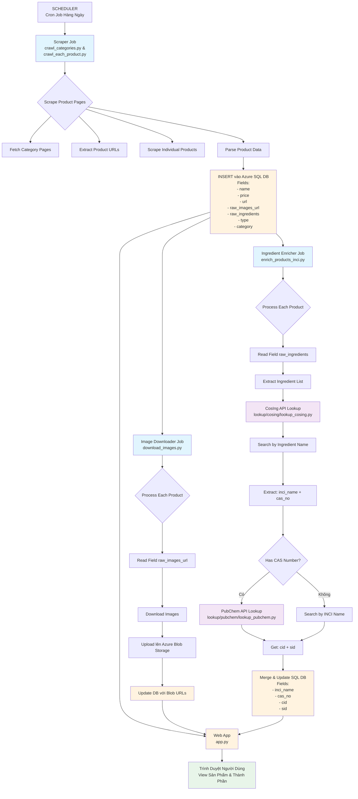
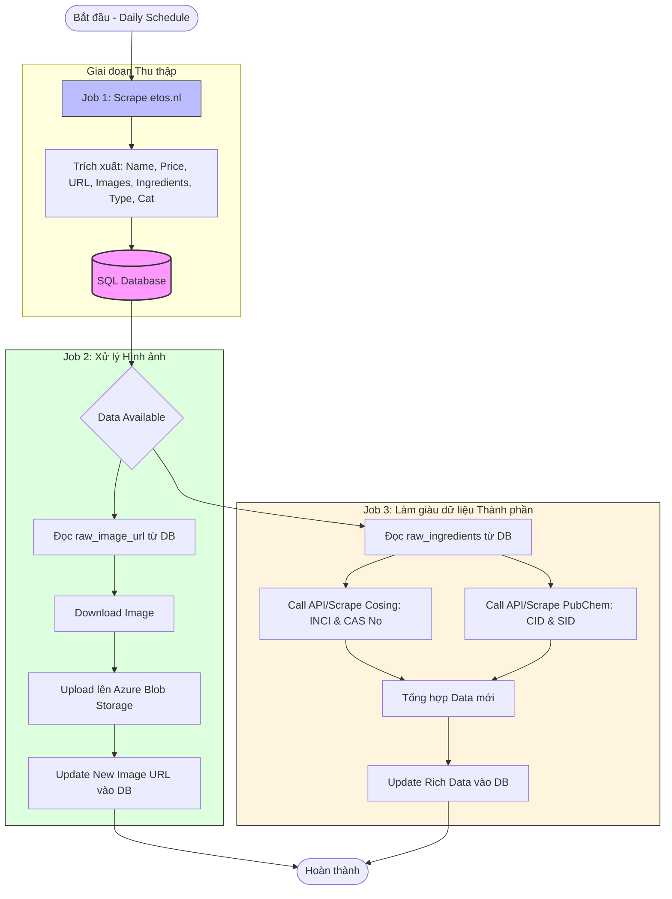
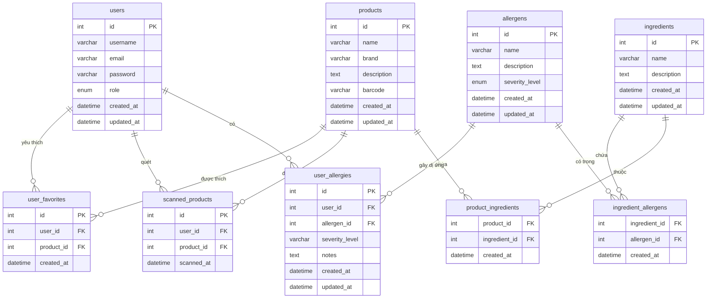

# Tài Liệu Kiến Trúc Phần Mềm (SAD)
## Allergy Label Crawler - Etos.nl

**Phiên bản:** 1.0
**Cập nhật lần cuối:** 2026-04-06
**Tác giả:** Đội phát triển

---

## Mục Lục

1. [Tổng Quan Dự Án](#1-tổng-quan-dự-án)
2. [Kiến Trúc Hệ Thống](#2-kiến-trúc-hệ-thống)
3. [Luồng Dữ Liệu Chính](#3-luồng-dữ-liệu-chính)
   - [3.1 Pipeline Đầu Cuối](#31-pipeline-đầu-cuối)
   - [3.2 Sơ Đồ Tổng Quát Jobs](#32-sơ-đồ-tổng-quát-jobs)
   - [3.3 Chi Tiết Thực Thi Jobs](#33-chi-tiết-thực-thi-jobs)
4. [Mô Tả Các Thành Phần](#4-mô-tả-các-thành-phần)
5. [Cấu Trúc Database](#5-cấu-trúc-database)
6. [Tích Hợp API Bên Ngoài](#6-tích-hợp-api-bên-ngoài)
7. [Công Nghệ Sử Dụng](#7-công-nghệ-sử-dụng)
8. [Lưu Ý Triển Khai](#8-lưu-ý-triển-khai)

---

## 1. Tổng Quan Dự Án

### 1.1 Mục Đích
Allergy Label Crawler là hệ thống web scraping được thiết kế để trích xuất thông tin sản phẩm từ các website hiệu thuốc Hà Lan (chủ yếu là etos.nl). Hệ thống làm giàu dữ liệu sản phẩm với thông tin thành phần từ cơ sở dữ liệu EU CosIng và PubChem để giúp người dùng nhận diện các chất gây dị ứng tiềm ẩn trong mỹ phẩm và sản phẩm chăm sóc cá nhân.

### 1.2 Tính Năng Chính
- Tự động scrape dữ liệu sản phẩm hàng ngày từ các website thương mại điện tử
- Tải xuống và lưu trữ hình ảnh trên Azure Blob Storage
- Làm giàu thông tin thành phần qua các API CosIng và PubChem
- Giao diện web để duyệt và tìm kiếm sản phẩm
- Hỗ trợ nhiều danh mục sản phẩm

### 1.3 Phạm Vi
- Website mục tiêu: etos.nl (mở rộng được các site hiệu thuốc Hà Lan khác)
- Loại sản phẩm: Mỹ phẩm, sản phẩm chăm sóc cá nhân, sản phẩm chăm sóc da
- Lưu trữ dữ liệu: Azure SQL Database + Azure Blob Storage

---

## 2. Kiến Trúc Hệ Thống

```
┌─────────────────────────────────────────────────────────────────────────────┐
│                          ALLERGY LABEL CRAWLER                              │
├─────────────────────────────────────────────────────────────────────────────┤
│                                                                             │
│  ┌──────────────┐      ┌──────────────┐      ┌──────────────┐              │
│  │   LỊCH TRÌNH  │─────▶│  HÀNG ĐỢI   │─────▶│   WORKER    │              │
│  │   (cron)     │      │  (task mgmt) │      │  (executors) │              │
│  └──────────────┘      └──────────────┘      └──────────────┘              │
│          │                     │                       │                    │
│          ▼                     ▼                       ▼                    │
│  ┌──────────────┐      ┌──────────────┐      ┌──────────────┐              │
│  │  SCRAPER     │      │  DOWNLOADER  │      │  ENRICHER    │              │
│  │  Job 1       │      │  Job 2       │      │  Job 3       │              │
│  └──────────────┘      └──────────────┘      └──────────────┘              │
│          │                     │                       │                    │
│          ▼                     ▼                       ▼                    │
│  ┌──────────────┐      ┌──────────────┐      ┌──────────────┐              │
│  │Azure SQL DB  │      │Azure Blob    │      │Azure SQL DB  │              │
│  │(products)    │      │Storage       │      │(ingredients) │              │
│  └──────────────┘      └──────────────┘      └──────────────┘              │
│                                                                             │
│  ┌──────────────────────────────────────────────────────────────────────┐  │
│  │                    GIAO DIỆN WEB (Flask)                             │  │
│  └──────────────────────────────────────────────────────────────────────┘  │
└─────────────────────────────────────────────────────────────────────────────┘
```

---

## 3. Luồng Dữ Liệu Chính

### 3.1 Pipeline Đầu Cuối



### 3.2 Sơ Đồ Tổng Quát Jobs



### 3.3 Chi Tiết Thực Thi Jobs

#### Job 1: Product Scraper (Hàng Ngày)
| Thành Phần | File | Mô Tả |
|-----------|------|-------------|
| Category Crawler | `crawl_categories.py` | Lấy trang danh mục, phát hiện URL sản phẩm |
| Product Scraper | `crawl_each_product.py` | Scrape trang sản phẩm cá nhân để lấy dữ liệu |
| Ingredient Extractor | `extract_ingredients.py` | Phân tích raw ingredients thành danh sách có cấu trúc |

**Thực thi:** Chạy hàng ngày vào thời điểm đã lên lịch qua cron

#### Job 2: Image Downloader
| Thành Phần | File | Mô Tả |
|-----------|------|-------------|
| Image Downloader | `download_images.py` | Tải ảnh từ URLs, upload lên Azure Blob |

**Thực thi:** Chạy sau khi Job 1 hoàn thành

#### Job 3: Ingredient Enricher
| Thành Phần | File | Mô Tả |
|-----------|------|-------------|
| Enrichment Orchestrator | `enrich_products_inci.py` | Điều phối workflow làm giàu dữ liệu |
| CosIng Lookup | `lookup/cosing/lookup_cosing.py` | Truy vấn EU CosIng API |
| PubChem Lookup | `lookup/pubchem/lookup_pubchem.py` | Truy vấn PubChem API |

**Thực thi:** Chạy sau khi Job 2 hoàn thành

---

## 4. Mô Tả Các Thành Phần

### 4.1 Các Thành Phần Scraper

#### 4.1.1 crawl_categories.py
**Mục Đích:** Phát hiện và danh mục URL sản phẩm từ các trang danh mục.

**Các Hàm Chính:**
- `fetch_product_urls_page()` - Lấy danh sách sản phẩm phân trang async
- `category_slug_from_url()` - Tạo định danh danh mục
- Hỗ trợ tiếp tục từ vị trí xử lý lần cuối
- Chế độ re-scrape để cập nhật sản phẩm có sẵn

**Đầu Ra:** `_urls.txt` và `_meta.json` cho mỗi danh mục

#### 4.1.2 crawl_each_product.py
**Mục Đích:** Trích xuất thông tin chi tiết sản phẩm từ các trang cá nhân.

**Các Hàm Chính:**
- `fetch_html()` - HTTP client với logic retry
- `extract_product_data()` - Điều phối trích xuất dữ liệu chính
- `extract_product_name()` - Phân tích tên sản phẩm
- `extract_images()` - Trích xuất URL hình ảnh sản phẩm
- `extract_price()` - Giá từ schema JSON-LD
- `extract_raw_ingredients()` - Phân tích danh sách thành phần
- `extract_product_type()` - Phân loại sản phẩm
- `extract_product_category()` - Phân tích breadcrumb danh mục

**Đầu Ra:** `{sku}.json` cho mỗi sản phẩm với cấu trúc:
```json
{
  "product_information": {
    "product_url": "...",
    "images": ["...", "..."],
    "website": "www.etos.nl",
    "product_name": "...",
    "price": "...",
    "description": "..."
  },
  "inferred_information": {
    "raw_ingredients": "...",
    "ingredients": ["...", "..."],
    "product_type": "...",
    "product_category": "...",
    "inci": {}
  },
  "additional_information": {
    "id": "..."
  }
}
```

#### 4.1.3 extract_ingredients.py
**Mục Đích:** Phân tích văn bản thành phần thô thành danh sách có cấu trúc.

**Tính Năng Chính:**
- Xử lý định dạng thành phần tiếng Hà Lan
- Loại bỏ disclaimers và metadata
- Tách theo nhiều delimiter (dấu phẩy, bullet, dấu gạch chéo)
- Loại bỏ trùng lặp nhưng giữ thứ tự

### 4.2 Các Thành Phần Lưu Trữ

#### 4.2.1 download_images.py
**Mục Đích:** Tải xuống và lưu trữ hình ảnh sản phẩm.

**Tính Năng Chính:**
- Tải đa luồng (10 workers)
- Có thể tiếp tục (bỏ qua ảnh đã có)
- Header User-Agent để tuân thủ
- Tổ chức theo ID sản phẩm

### 4.3 Các Thành Phần Làm Giàu Dữ Liệu

#### 4.3.1 enrich_products_inci.py
**Mục Đích:** Điều phối làm giàu dữ liệu thành phần.

**Workflow:**
1. Đọc field `ingredients` từ JSON sản phẩm
2. Với mỗi thành phần:
   - Truy vấn CosIng API
   - Trích xuất tên INCI và số CAS
   - Truy vấn PubChem với CAS/tên INCI
   - Gộp kết quả
3. Cập nhật JSON sản phẩm với dữ liệu đã làm giàu
4. Theo dõi tiến trình qua `enriched_count` trong meta

#### 4.3.2 CosIng Lookup (lookup/cosing/)
**Mục Đích:** Truy vấn cơ sở dữ liệu EU CosIng để lấy thông tin thành phần.

**Chi Tiết API:**
- Base URL: `https://api.tech.ec.europa.eu/search-api/prod/rest/search`
- Trường tìm kiếm: Tên INCI, tên USA, tên INN, tên PhEur, tên hóa học
- Trả về: Tên INCI, số CAS, ID tham chiếu
- Caching: Cache local cho phản hồi API

#### 4.3.3 PubChem Lookup (lookup/pubchem/)
**Mục Đích:** Truy vấn PubChem để lấy định danh hóa học.

**Chi Tiết API:**
- Base URL: `https://pubchem.ncbi.nlm.nih.gov/rest/pug`
- Tìm kiếm: Endpoint disambiguate để tìm CID
- Chi tiết: Endpoint pug_view để trích xuất SID
- Trả về: CID (Compound ID), SID (Substance ID)
- Caching: Cache local cho phản hồi API

### 4.4 Giao Diện Web

#### 4.4.1 app.py (Flask Application)
**Mục Đích:** Cung cấp UI web để duyệt sản phẩm.

**Routes:**
- `/` - Liệt kê danh mục
- `/category/<name>/` - Liệt kê sản phẩm theo danh mục
- `/product/<category>/<id>/` - Chi tiết sản phẩm với thành phần
- `/login` - Xác thực

**Tính Năng:**
- Yêu cầu xác thực
- Phân trang (20 items mỗi trang)
- Chế độ xem bảng và thẻ
- Hiển thị dữ liệu INCI (định dạng cũ và mới)

---

## 5. Cấu Trúc Database

### 5.1 Sơ Đồ Entity-Relationship (ERD)



### 5.2 Chi Tiết Các Bảng

#### 5.2.1 Bảng users - Người Dùng

| Column | Type | Attributes | Mô Tả |
|--------|------|------------|-------|
| id | INT | PK, AUTO_INCREMENT | ID duy nhất của người dùng |
| username | VARCHAR(255) | UNIQUE, NOT NULL | Tên đăng nhập |
| email | VARCHAR(255) | UNIQUE, NOT NULL | Email người dùng |
| password | VARCHAR(255) | NOT NULL | Mật khẩu đã được hash |
| role | ENUM | ('user', 'admin') | Vai trò người dùng |
| created_at | DATETIME | DEFAULT CURRENT_TIMESTAMP | Thời gian tạo tài khoản |
| updated_at | DATETIME | ON UPDATE CURRENT_TIMESTAMP | Thời gian cập nhật lần cuối |

#### 5.2.2 Bảng products - Sản Phẩm

| Column | Type | Attributes | Mô Tả |
|--------|------|------------|-------|
| id | INT | PK, AUTO_INCREMENT | ID duy nhất của sản phẩm |
| name | VARCHAR(255) | NOT NULL | Tên sản phẩm |
| brand | VARCHAR(255) | | Thương hiệu |
| description | TEXT | | Mô tả sản phẩm |
| barcode | VARCHAR(50) | UNIQUE | Mã vạch sản phẩm |
| created_at | DATETIME | DEFAULT CURRENT_TIMESTAMP | Thời gian tạo bản ghi |
| updated_at | DATETIME | ON UPDATE CURRENT_TIMESTAMP | Thời gian cập nhật lần cuối |

#### 5.2.3 Bảng ingredients - Thành Phần

| Column | Type | Attributes | Mô Tả |
|--------|------|------------|-------|
| id | INT | PK, AUTO_INCREMENT | ID duy nhất của thành phần |
| name | VARCHAR(255) | UNIQUE, NOT NULL | Tên thành phần (INCI name) |
| description | TEXT | | Mô tả chi tiết |
| created_at | DATETIME | DEFAULT CURRENT_TIMESTAMP | Thời gian tạo bản ghi |
| updated_at | DATETIME | ON UPDATE CURRENT_TIMESTAMP | Thời gian cập nhật lần cuối |

#### 5.2.4 Bảng allergens - Chất Gây Dị Ứng

| Column | Type | Attributes | Mô Tả |
|--------|------|------------|-------|
| id | INT | PK, AUTO_INCREMENT | ID duy nhất của chất gây dị ứng |
| name | VARCHAR(255) | UNIQUE, NOT NULL | Tên chất gây dị ứng |
| description | TEXT | | Mô tả chi tiết |
| severity_level | ENUM | ('low', 'medium', 'high') | Mức độ nghiêm trọng |
| created_at | DATETIME | DEFAULT CURRENT_TIMESTAMP | Thời gian tạo bản ghi |
| updated_at | DATETIME | ON UPDATE CURRENT_TIMESTAMP | Thời gian cập nhật lần cuối |

#### 5.2.5 Bảng product_ingredients - Sản Phẩm <--> Thành Phần (Many-to-Many)

| Column | Type | Attributes | Mô Tả |
|--------|------|------------|-------|
| product_id | INT | FK, NOT NULL | Khóa ngoại đến products.id |
| ingredient_id | INT | FK, NOT NULL | Khóa ngoại đến ingredients.id |
| created_at | DATETIME | DEFAULT CURRENT_TIMESTAMP | Thời gian tạo bản ghi |

**Primary Key:** (product_id, ingredient_id)

#### 5.2.6 Bảng ingredient_allergens - Thành Phần <--> Chất Gây Dị Ứng (Many-to-Many)

| Column | Type | Attributes | Mô Tả |
|--------|------|------------|-------|
| ingredient_id | INT | FK, NOT NULL | Khóa ngoại đến ingredients.id |
| allergen_id | INT | FK, NOT NULL | Khóa ngoại đến allergens.id |
| created_at | DATETIME | DEFAULT CURRENT_TIMESTAMP | Thời gian tạo bản ghi |

**Primary Key:** (ingredient_id, allergen_id)

#### 5.2.7 Bảng user_allergies - Dị Ứng Cá Nhân

| Column | Type | Attributes | Mô Tả |
|--------|------|------------|-------|
| id | INT | PK, AUTO_INCREMENT | ID duy nhất của bản ghi |
| user_id | INT | FK, NOT NULL | Khóa ngoại đến users.id |
| allergen_id | INT | FK, NOT NULL | Khóa ngoại đến allergens.id |
| severity_level | VARCHAR(50) | | Mức độ nghiêm trọng cá nhân |
| notes | TEXT | | Ghi chú thêm |
| created_at | DATETIME | DEFAULT CURRENT_TIMESTAMP | Thời gian tạo bản ghi |
| updated_at | DATETIME | ON UPDATE CURRENT_TIMESTAMP | Thời gian cập nhật lần cuối |

#### 5.2.8 Bảng scanned_products - Lịch Sử Quét Mã

| Column | Type | Attributes | Mô Tả |
|--------|------|------------|-------|
| id | INT | PK, AUTO_INCREMENT | ID duy nhất của bản ghi |
| user_id | INT | FK, NOT NULL | Khóa ngoại đến users.id |
| product_id | INT | FK, NOT NULL | Khóa ngoại đến products.id |
| scanned_at | DATETIME | DEFAULT CURRENT_TIMESTAMP | Thời gian quét |

#### 5.2.9 Bảng user_favorites - Sản Phẩm Yêu Thích

| Column | Type | Attributes | Mô Tả |
|--------|------|------------|-------|
| id | INT | PK, AUTO_INCREMENT | ID duy nhất của bản ghi |
| user_id | INT | FK, NOT NULL | Khóa ngoại đến users.id |
| product_id | INT | FK, NOT NULL | Khóa ngoại đến products.id |
| created_at | DATETIME | DEFAULT CURRENT_TIMESTAMP | Thời gian thêm vào yêu thích |

**Primary Key:** (user_id, product_id)

### 5.3 Bảng Product Crawler (Azure SQL)

| Column | Type | Mô Tả | Nguồn |
|--------|------|-------------|--------|
| id | VARCHAR(50) | SKU / ID sản phẩm | `additional_information.id` |
| name | NVARCHAR(MAX) | Tên sản phẩm | `product_information.product_name` |
| price | NVARCHAR(50) | Giá sản phẩm | `product_information.price` |
| url | NVARCHAR(MAX) | URL sản phẩm | `product_information.product_url` |
| raw_images_url | NVARCHAR(MAX) | JSON array URL ảnh | `product_information.images` |
| raw_ingredients | NVARCHAR(MAX) | Văn bản thành phần thô | `inferred_information.raw_ingredients` |
| type | NVARCHAR(100) | Loại sản phẩm | `inferred_information.product_type` |
| category | NVARCHAR(100) | Danh mục sản phẩm | `inferred_information.product_category` |
| image_blob_urls | NVARCHAR(MAX) | JSON array URL blob | Sau download_images.py |
| inci_data | NVARCHAR(MAX) | JSON dữ liệu thành phần đã làm giàu | Sau enrich_products_inci.py |
| created_at | DATETIME | Timestamp tạo bản ghi | Hệ thống |
| updated_at | DATETIME | Timestamp cập nhật lần cuối | Hệ thống |

### 5.4 Cấu Trúc Làm Giàu Thành Phần

```json
{
  "inci": {
    "ten_thanh_phan_lower": {
      "cosing_info": {
        "reference": "UUID",
        "inci_name": "AQUA",
        "cas_no": ["7732-18-5"]
      },
      "pubchem_info": [
        {
          "cid": "962",
          "sid": "3301",
          "cas_no": "7732-18-5"
        }
      ]
    }
  }
}
```

---

## 6. Tích Hợp API Bên Ngoài

### 6.1 EU CosIng API

**Mục Đích:** Cơ sở dữ liệu thành phần mỹ phẩm Châu Âu

**Endpoint:** `https://api.tech.ec.europa.eu/search-api/prod/rest/search`

**Định Dạng Request:**
```json
{
  "bool": {
    "must": [
      {
        "text": {
          "query": "ten_thanh_phan",
          "fields": ["inciName.exact", "inciUsaName", "innName.exact", ...]
        }
      },
      {
        "terms": {
          "itemType": ["ingredient", "substance"]
        }
      }
    ]
  }
}
```

**Giới Hạn Tốc Độ:** Độ trễ 0.5 giây giữa các requests

**Caching:** Cache file local dưới `lookup/cosing/cache/`

### 6.2 PubChem API

**Mục Đích:** Cơ sở dữ liệu hóa học NCBI

**Endpoints:**
- Tìm kiếm: `https://pubchem.ncbi.nlm.nih.gov/rest/pug/disambiguate/name/JSON?name={query}`
- Chi tiết: `https://pubchem.ncbi.nlm.nih.gov/rest/pug_view/data/compound/{cid}/JSON/`

**Logic Retry:** 3 lần thử với độ trễ 1 giây

**Caching:** Cache file local dưới `lookup/pubchem/cache/`

---

## 7. Công Nghệ Sử Dụng

### 7.1 Backend
- **Ngôn Ngữ:** Python 3.x
- **Web Framework:** Flask 3.0+
- **HTTP Client:** requests 2.31+
- **HTML Parsing:** BeautifulSoup4 4.12+

### 7.2 Lưu Trữ
- **Database:** Azure SQL Database
- **Blob Storage:** Azure Blob Storage
- **Local Cache:** File system (JSON)

### 7.3 Triển Khai
- **Scheduler:** cron (Linux) hoặc tương đương
- **Process Management:** systemd/supervisor (khuyến nghị)

### 7.4 Dependencies
```
flask>=3.0.0
requests>=2.31.0
beautifulsoup4>=4.12.0
```

---

## 8. Lưu Ý Triển Khai

### 8.1 Biến Môi Trường

| Biến | Mô Tả | Bắt Buộc |
|----------|-------------|----------|
| `FLASK_SECRET_KEY` | Mã hóa session Flask | Có |
| `AZURE_SQL_CONNECTION_STRING` | Kết nối database | Có |
| `AZURE_BLOB_CONNECTION_STRING` | Kết nối blob storage | Có |
| `COSING_API_KEY` | API key CosIng | Có |
| `PORT` | Cổng web server | Không (mặc định: 5000) |

### 8.2 Ví Đụ Cron Schedule

```bash
# Product scraping - Hàng ngày lúc 2 giờ sáng
0 2 * * * cd /path/to/crawler && python crawl_categories.py

# Image download - Hàng ngày lúc 4 giờ sáng
0 4 * * * cd /path/to/crawler && python download_images.py

# Ingredient enrichment - Hàng ngày lúc 6 giờ sáng
0 6 * * * cd /path/to/crawler && python enrich_products_inci.py
```

### 8.2 Khuyến Nghị Monitoring

1. **Log Aggregation:** Tập trung log từ tất cả jobs
2. **Failure Alerts:** Giám sát exit code của jobs
3. **API Rate Limits:** Theo dõi sử dụng quota CosIng và PubChem
4. **Storage Metrics:** Giám sát mức sử dụng Azure blob storage
5. **Database Performance:** Thời gian phản hồi query

### 8.4 Xử Lý Lỗi

- **Retry Logic:** Đã triển khai cho HTTP requests
- **Graceful Degradation:** Thiếu dữ liệu làm giàu không làm lỗi hiển thị
- **Checkpointing:** Jobs tiếp tục từ item được xử lý lần cuối
- **Logging:** Thông báo lỗi chi tiết để debug

---

## Phụ Lục A: Cấu Trúc File

```
etos.nl/
├── app.py                      # Flask web application
├── crawl_categories.py         # Phát hiện URL danh mục
├── crawl_each_product.py       # Scrape dữ liệu sản phẩm
├── download_images.py          # Xử lý tải ảnh
├── enrich_products_inci.py     # Điều phối làm giàu thành phần
├── extract_ingredients.py      # Phân tích thành phần
├── lookup/
│   ├── cosing/
│   │   ├── lookup_cosing.py   # Client CosIng API
│   │   └── cache/              # Cache phản hồi API
│   └── pubchem/
│       ├── lookup_pubchem.py  # Client PubChem API
│       └── cache/              # Cache phản hồi API
├── products/                   # Lưu trữ JSON sản phẩm
│   └── dermacare/
│       ├── *_meta.json         # Metadata danh mục
│       └── *.json              # File dữ liệu sản phẩm
├── images/                     # Ảnh đã tải xuống
├── requirements.txt            # Dependencies Python
└── docs/
    └── SAD/
        └── README_VN.md        # Tài liệu này
```

---

**Hết Tài Liệu**
